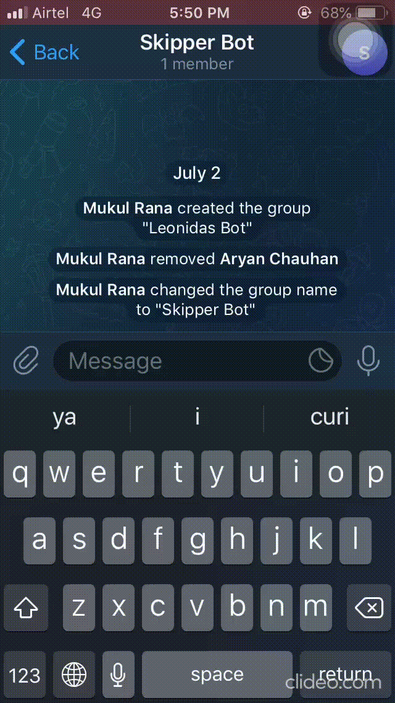
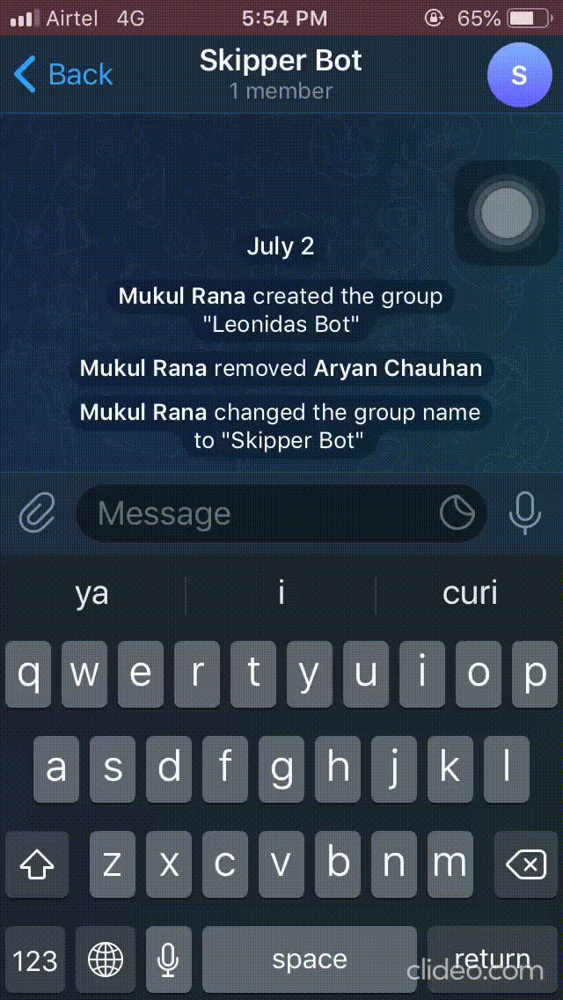
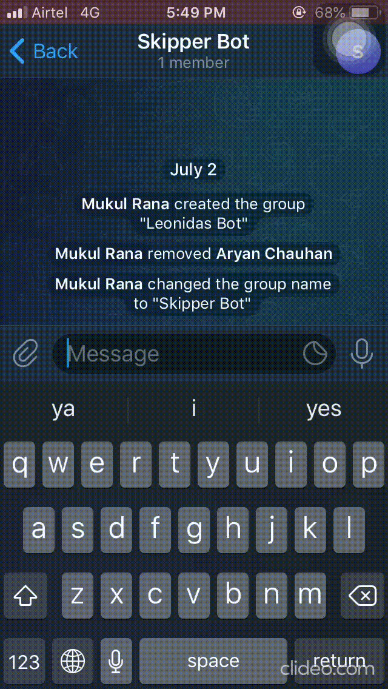
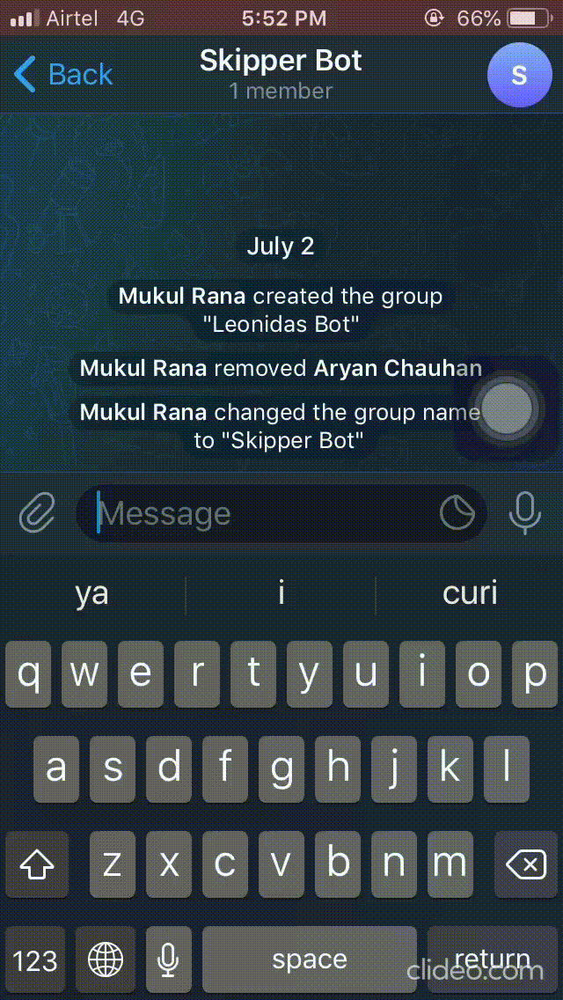

# Telegram-Bot
Telegram bot helps us to connect to our pc using telegram from any device and perform some tasks like a TODO list, Curi list and obtaining screenshot using commands in chat.


## Features 


* Obtain screenshot of current window open on pc



* Add and delete tasks in ToDo list 



* Add and delete queries in Curi List (list of questions born from curiosity )
<p float = 'left'>



</p>

##  Installation 
1. Telegram Bot requires [Python 3] to run.
2. Obtain Telegram api_id and api_hash from [Telegram api].
3. Create a channel on telegram and obtain its link.
4. Install following python modules using command prompt.
`pip install telethon `
`pip install pyautogui`
5. Enter your `api_id` , `api_hash`, `username` , `phone_number` and `channel link` in telegram.py:
```
api_id = ******
api_hash = '**********************'
username = '********'
phone= '+91*********'
user_input_channel = 'https://t.me/***********'
```
6. If you are first time user, then it authenticates by using OTP and a `.session` file is created in the directory after successful authentication. There is no need to re-authenticate until the `.session` is available in the directory

## How to use
* First enter the reset time for application to recheck latest commands (in seconds).
* Enter the time for which you want to run the application (in minutes).
* Enter the commands you wanna run for following tasks:
    * Screenshot : `screen`  
    * Todo List : 
        * `task` for viewing tasks
        * `task add : Any task you wanna add` for adding tasks
        * `task delete : index number of task you wanna delete` for deleting task ( you can see index number by running task command)
    * Curi List:
        * `curi` for viewing tasks
        * `curi add : Any Question you wanna add` for adding tasks
        * `curi delete : index number of question you wanna delete` for deleting question ( you can see index number by running curi command)
     > Note: The above commands are case-insensitive i.e, you can enter command in any case but the query or task you are going to add is in the same case as you are entering.

[Telegram api]:<https://core.telegram.org/api/obtaining_api_id>
[Python 3]:<https://www.python.org/downloads/>


